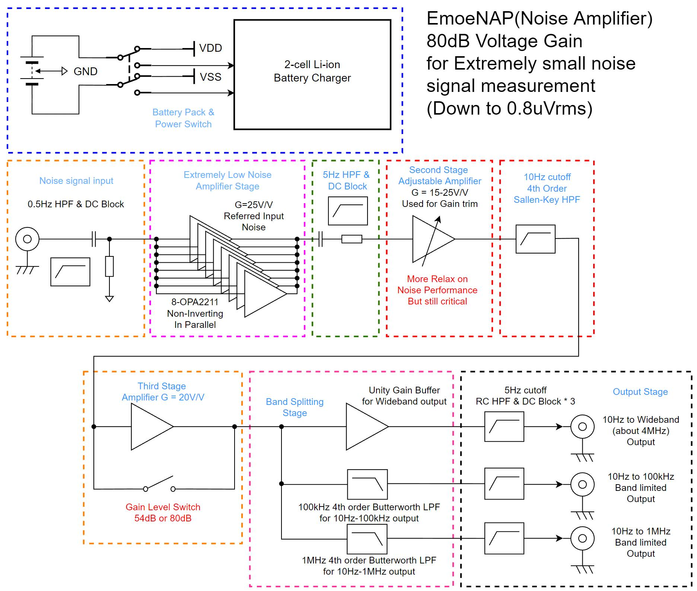

# Noise Amplifier

An ultra-low noise amplifier **(named EmoeNAP)** capable to measure low-noise LDO/OPA's wide band output noise, and many other interesting measurements. Referred to **[AN-159](https://www.analog.com/en/app-notes/an-159.html)**.

The full article about the initial version of Noise Amp can be found here:**[How to build a Noise Amplifier](https://www.emoe.xyz/noise-amplifier-building-instruction/)**. And to step further, to build the current version named **EmoeNAP**，please follow **[Noise Amplifier Step further](https://www.emoe.xyz/noise-amplifier-step-further/)**

Test result show that: with input shorted, the total output noise in 100kHz bandwidth is 1.76mVrms, and **the EmoeNAP's Gain equals to 80dB**, which results in **176nVrms input noise.**

Then connect a 50 ohms SMA Load to input, the total output noise in 100kHz bandwidth is 3.65mVrms, which equals in 365nVrms input noise.

A 50 ohms resistor's Johnson-Nyquist Noise(Themal noise) in 100kHz is 316nVrms(Theoretical), and 316nVrms combine with 176nVrms, resulting 361nVrms total output noise. This test verified the EmoeNAP's extraordinary ability to measure a 50 ohms resistor's Thermal Noise precisely.

# Still In Progress

**V2.3 has been verified but still needs improving.**    
In next version of EmoeNAP, I plan to change its architecture a little to the form below:

## V2.3 Known Issue

- Poor layout of output low-pass filter, to be re-designed.  
- Input Riso is not needed, because it introduces more thermal noise to input.(Can be seen as source impedance)  
- A resistor should be connected in series at wideband output port, because capacitive load( osilloscope input port, such as) can cause loop instability problem, so a resistor is needed to isolate the opamp output to load capacitor. A common value of 100 ohms is recommended.

